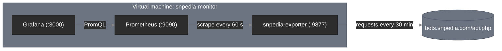

# SNPedia Knowledge Exporter

[](https://www.ansible.com/)
[](https://prometheus.io/)
[](https://grafana.com/)
[](https://www.python.org/)
[](https://www.vagrantup.com/)


## Table of Contents

- [What It Is](#what-it-is)
- [Preview in Action](#preview-in-action)
- [Requirements](#requirements)
- [How to Deploy and Run](#how-to-deploy-and-run)
- [Project Structure](#project-structure)
- [Advanced Usage: Tracking Custom Categories](#advanced-usage-tracking-custom-categories)
  - [Testing Locally Before Deploying](#testing-locally-before-deploying)
- [License](#license)

## What It Is

This repository contains a custom [Prometheus exporter](https://prometheus.io/docs/instrumenting/writing_exporters/) written in Python that collects statistics about [SNPedia](https://www.snpedia.com), a wiki about human genetic variation, through the [MediaWiki Action API](https://www.mediawiki.org/wiki/API:Main_page). The exporter, [Prometheus](https://prometheus.io/) and [Grafana](https://grafana.com/) are deployed to a single virtual machine with one [Ansible](https://docs.ansible.com/) playbook.

Once deployed, the exporter fetches data from SNPedia in the background every 30 minutes and exposes it on `/metrics`. Prometheus scrapes these metrics and evaluates alerting rules, while Grafana shows how many SNPs, genes and conditions the wiki describes, how actively it is edited, and how many days have passed since the last change. Because `/metrics` only serves cached values, Prometheus scrapes never generate traffic to SNPedia.



## Preview in Action

Querying the exporter returns the current state of the knowledge base (values below are illustrative):

```bash
$ curl -s http://192.168.56.10:9877/metrics | grep snpedia_
# HELP snpedia_up Whether the last data fetch from SNPedia succeeded (1) or failed (0).
# TYPE snpedia_up gauge
snpedia_up 1.0
# HELP snpedia_last_success_timestamp_seconds Unix time of the last successful data fetch.
# TYPE snpedia_last_success_timestamp_seconds gauge
snpedia_last_success_timestamp_seconds 1.7890848e+09
# HELP snpedia_site_articles Number of articles in the wiki.
# TYPE snpedia_site_articles gauge
snpedia_site_articles 110000.0
# HELP snpedia_site_edits_total Total number of edits in the wiki's history.
# TYPE snpedia_site_edits_total counter
snpedia_site_edits_total 1.65e+06
# HELP snpedia_category_pages Number of pages in a SNPedia category.
# TYPE snpedia_category_pages gauge
snpedia_category_pages{category="Is_a_snp"} 110000.0
snpedia_category_pages{category="Is_a_genotype"} 100000.0
snpedia_category_pages{category="Is_a_gene"} 10000.0
snpedia_category_pages{category="Is_a_medical_condition"} 500.0
snpedia_category_pages{category="Is_a_medicine"} 400.0
# HELP snpedia_recent_changes_7d Number of edits and new pages in the last 7 days.
# TYPE snpedia_recent_changes_7d gauge
snpedia_recent_changes_7d 12.0
# HELP snpedia_last_change_timestamp_seconds Unix time of the most recent change in the wiki.
# TYPE snpedia_last_change_timestamp_seconds gauge
snpedia_last_change_timestamp_seconds 1.7889e+09
```

Prometheus evaluates three alerting rules from `monitoring/alerts.yml`:

| Alert | Condition | Meaning |
|---|---|---|
| `SNPediaExporterDown` | `up{job="snpedia_exporter"} == 0` for 5m | Prometheus cannot reach the exporter |
| `SNPediaApiUnreachable` | `snpedia_up == 0` for 1h | The SNPedia API is not responding |
| `SNPediaNoRecentChanges` | `(time() - snpedia_last_change_timestamp_seconds) / 86400 > 30` for 1h | No edits for more than 30 days |

The Grafana dashboard shows the knowledge base size, category growth over time, edits per day, changes in the last 7 days, days since the last change (green below 7, yellow below 30, red from 30), exporter status, and SNPedia attribution.

## Requirements

- [Vagrant](https://www.vagrantup.com/) with [VirtualBox](https://www.virtualbox.org/), or any Ubuntu 22.04/24.04 machine reachable over SSH.
- [ansible-core](https://docs.ansible.com/ansible/latest/installation_guide/index.html) 2.15 or newer.
- [Python](https://www.python.org/) 3.11 or newer (only for running the exporter locally).

## How to Deploy and Run

1. **Clone the repository** and navigate to the project directory:
   ```bash
   git clone https://github.com/your-username/snpedia-knowledge-exporter.git
   cd snpedia-knowledge-exporter
   ```

2. **Start the virtual machine**:
   ```bash
   vagrant up
   ```

3. **Set your contact address** in `exporter/config.yml`:
   ```yaml
   user_agent: "snpedia-knowledge-exporter/0.1 (your-email@example.com)"
   ```

4. **Run the playbook**:
   ```bash
   cd ansible
   ansible-playbook site.yml
   ```
   The inventory in `ansible/inventory.yml` assumes the default Vagrant setup (`192.168.56.10`). To deploy to another host, change the address and SSH user there. The playbook is idempotent, so a second run should finish with `changed=0`.

5. **Open the services**:
   ```text
   Exporter:    http://192.168.56.10:9877/metrics
   Prometheus:  http://192.168.56.10:9090
   Grafana:     http://192.168.56.10:3000
   ```

## Project Structure

```text
.
├── README.md                          # Project documentation
├── Vagrantfile                        # Single Ubuntu virtual machine
├── exporter/
│   ├── exporter.py                    # Entire exporter in one file
│   ├── requirements.txt               # prometheus-client, requests, PyYAML
│   └── config.yml                     # API address, User-Agent, interval, categories
├── ansible/
│   ├── ansible.cfg                    # Ansible settings
│   ├── inventory.yml                  # Target host
│   ├── site.yml                       # Playbook running the three roles below
│   └── roles/
│       ├── snpedia_exporter/          # System user, virtualenv, systemd service
│       │   ├── tasks/main.yml
│       │   ├── handlers/main.yml
│       │   └── templates/
│       │       └── snpedia-exporter.service.j2
│       ├── prometheus/                # Package install, config and rules validated with promtool
│       │   ├── tasks/main.yml
│       │   └── handlers/main.yml
│       └── grafana/                   # Official repository, data source and dashboard provisioning
│           ├── tasks/main.yml
│           └── handlers/main.yml
└── monitoring/
    ├── prometheus.yml                 # Scrape configuration
    ├── alerts.yml                     # Three alerting rules
    ├── grafana-datasource.yml         # Data source provisioning
    ├── grafana-dashboards.yml         # Dashboard provisioning
    └── snpedia-dashboard.json         # Grafana dashboard
```

## Advanced Usage: Tracking Custom Categories

By default the exporter tracks five SNPedia categories. To track different ones, edit the `categories` list in `exporter/config.yml`, using category names exactly as they appear in the wiki, with underscores instead of spaces:

```yaml
api_url: https://bots.snpedia.com/api.php
user_agent: "snpedia-knowledge-exporter/0.1 (your-email@example.com)"
interval_minutes: 30
port: 9877
categories:
  - Is_a_snp
  - Is_a_genotype
  - Is_a_gene
  - Is_a_medical_condition
  - Is_a_medicine
```

All categories are fetched in a single API request, so adding more of them does not increase the number of requests sent to SNPedia.

### Testing Locally Before Deploying

You can run the exporter on your own machine to check the new categories before deploying them:

```bash
cd exporter
python -m venv .venv
source .venv/bin/activate
pip install -r requirements.txt
python exporter.py --config config.yml
curl -s http://localhost:9877/metrics | grep snpedia_category_pages
```

If a category does not exist, the exporter logs a warning and skips it. Once the output looks correct, redeploy with `cd ansible && ansible-playbook site.yml`.


## License

Distributed under the [MIT License](LICENSE). SNPedia data is not covered by this license (see [Acknowledgements](#acknowledgements)).
